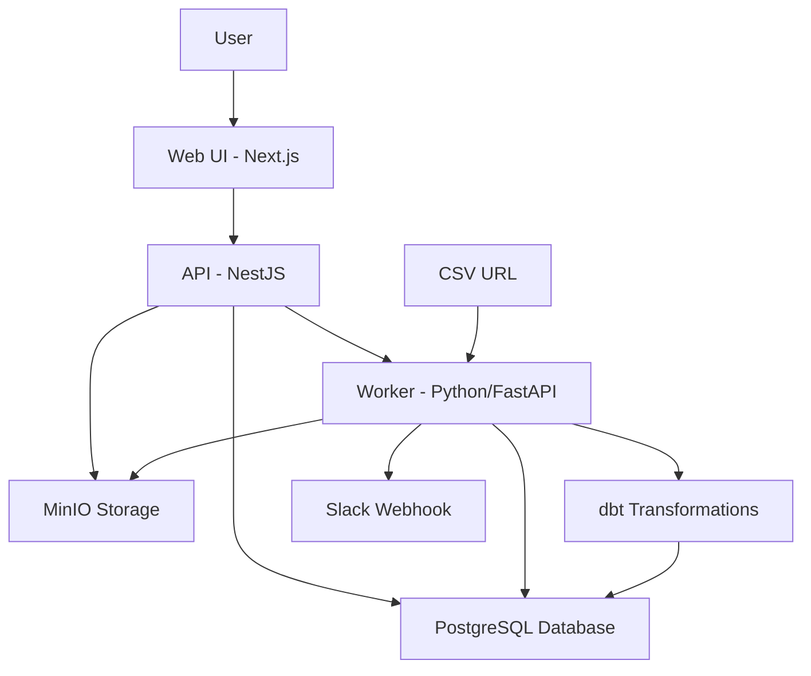

# 📊 Relayboard - Data Pipeline Platform

> **Transform CSV data into actionable insights delivered via Slack**

[](https://github.com/ODORA0)
[](https://www.typescriptlang.org/)
[](https://nextjs.org/)
[](https://nestjs.com/)

**Created by [AJAL ODORA JONATHAN](https://github.com/ODORA0)**

Relayboard is a modern data pipeline automation platform that transforms CSV/Google Sheets data into actionable insights delivered directly to your team's Slack channels. It automates the entire data processing workflow from ingestion to delivery.

## 🎯 **What Problem Does It Solve?**

Many teams struggle with:

- **Manual data processing** that's time-consuming and error-prone
- **Data silos** where insights don't reach the right people
- **Complex data pipelines** that require technical expertise
- **Delayed insights** that arrive too late to be actionable

Relayboard solves this by providing a **"data-to-notification"** system that automates the entire workflow.

## 🚀 **Core Features**

### **Automated Data Pipeline**

```
CSV URL → MinIO Storage → PostgreSQL Staging → dbt Transform → PostgreSQL Warehouse → Slack
```

### **One-Click Execution**

- Register CSV datasets via web interface
- Configure Slack webhook destinations
- Execute complete pipeline with single click
- Real-time feedback and error handling

### **Modern Tech Stack**

- **Frontend**: Next.js 15 with Tailwind CSS
- **API**: NestJS with TypeScript
- **Worker**: Python/FastAPI for data processing
- **Database**: PostgreSQL with staging/warehouse schemas
- **Storage**: MinIO (S3-compatible)
- **Transformations**: dbt for data modeling

## 🏗️ **Architecture Overview**



### **Component Details**

#### **Frontend (Next.js)** 🎨

- **Location**: `apps/web/`
- **Port**: 3000
- **Features**:
  - Modern, responsive UI with Tailwind CSS
  - Step-by-step pipeline configuration
  - Real-time loading states and feedback
  - Service status monitoring

#### **API (NestJS)** 🔌

- **Location**: `apps/api/`
- **Port**: 4000
- **Features**:
  - RESTful API endpoints
  - Database connection management
  - File storage integration
  - Pipeline orchestration

#### **Worker (Python/FastAPI)** 🐍

- **Location**: `apps/worker/`
- **Port**: 5055
- **Features**:
  - CSV processing and validation
  - PostgreSQL data loading
  - dbt model generation and execution
  - Slack webhook integration

#### **Infrastructure** 🏗️

- **PostgreSQL**: Port 5433 (staging + warehouse schemas)
- **MinIO**: Port 9000 (storage) + 9001 (console)
- **Redis**: Port 6379 (caching/queuing)

## 📋 **Quick Start**

### **Prerequisites**

- Node.js 18+ and pnpm
- Python 3.11+
- Docker and Docker Compose
- dbt CLI (optional, for local development)

### **1. Start Infrastructure Services**

```bash
# Start PostgreSQL, MinIO, and Redis
docker compose -f infra/docker/docker-compose.dev.yml up -d
```

### **2. Install Dependencies**

```bash
# Install all workspace dependencies
pnpm install
```

### **3. Start Development Services**

**Terminal 1 - API Server:**

```bash
pnpm --filter @relayboard/api dev
```

**Terminal 2 - Web Interface:**

```bash
pnpm --filter @relayboard/web dev
```

**Terminal 3 - Worker Service:**

```bash
cd apps/worker
pip install -r requirements.txt
./start.sh
```

### **4. Access the Application**

- **Web UI**: http://localhost:3000
- **API**: http://localhost:4000
- **Worker**: http://localhost:5055
- **MinIO Console**: http://localhost:9001

## 🔧 **API Endpoints**

### **Dataset Management**

```bash
# Register CSV dataset
POST /v1/datasets/csv
{
  "name": "sales_data",
  "csvUrl": "https://example.com/data.csv"
}
```

### **Destination Configuration**

```bash
# Configure Slack webhook
POST /v1/destinations/slack
{
  "webhookUrl": "https://hooks.slack.com/services/YOUR/SLACK/WEBHOOK"
}
```

### **Pipeline Execution**

```bash
# Run complete pipeline
POST /v1/pipelines/run
{
  "datasetName": "sales_data"
}
```

### **Health Check**

```bash
GET /health
```

## 📊 **Data Flow Process**

### **1. Data Ingestion**

- User provides CSV URL via web interface
- API downloads CSV and stores in MinIO
- Dataset metadata saved to PostgreSQL

### **2. Pipeline Execution**

- API triggers worker with pipeline parameters
- Worker downloads CSV from MinIO
- Data loaded into PostgreSQL `staging` schema
- dbt models auto-generated based on CSV schema
- dbt transformations executed
- Results loaded into `warehouse` schema

### **3. Delivery**

- Worker queries transformed data
- Results formatted and sent to Slack
- Pipeline status updated in database

## 🗄️ **Database Schema**

### **Core Tables**

```sql
-- Dataset registry
CREATE TABLE dataset (
  id SERIAL PRIMARY KEY,
  name TEXT UNIQUE NOT NULL,
  source_kind TEXT NOT NULL, -- 'csv'
  s3_key TEXT NOT NULL,
  created_at TIMESTAMPTZ DEFAULT NOW()
);

-- Destination configuration
CREATE TABLE destination (
  id SERIAL PRIMARY KEY,
  kind TEXT NOT NULL, -- 'slack'
  config_json JSONB NOT NULL,
  created_at TIMESTAMPTZ DEFAULT NOW()
);

-- Pipeline run tracking
CREATE TABLE run (
  id SERIAL PRIMARY KEY,
  dataset_id INT REFERENCES dataset(id),
  status TEXT NOT NULL,
  started_at TIMESTAMPTZ DEFAULT NOW(),
  finished_at TIMESTAMPTZ,
  error TEXT
);
```

### **Data Schemas**

- **`staging`**: Raw CSV data loaded from MinIO
- **`warehouse`**: Transformed data from dbt models

## 🔄 **dbt Integration**

### **Auto-Generated Models**

The worker automatically generates dbt models based on CSV schema:

```sql
-- Example: sales_data_clean.sql
select
  "date",
  "product_name",
  "quantity",
  "price"
from staging."sales_data"
```

### **dbt Project Structure**

```
dbt/relayboard/
├── dbt_project.yml
├── profiles.yml
└── models/
    ├── example.sql
    └── generated/          # Auto-generated models
        └── {dataset}_clean.sql
```

## 🎨 **Web Interface**

### **Step 1: Register CSV Dataset**

- Enter dataset name
- Provide CSV URL
- Click "Register CSV"

### **Step 2: Configure Slack Destination**

- Enter Slack webhook URL
- Click "Save Slack Destination"

### **Step 3: Run Pipeline**

- Click "Run Pipeline"
- Monitor progress with loading indicators
- View success/error feedback

### **Service Status**

- Real-time status of all services
- Connection indicators
- Service URLs and ports

## 🚀 **Deployment**

### **Development Environment**

```bash
# Start all services
docker compose -f infra/docker/docker-compose.dev.yml up -d
pnpm --filter @relayboard/api dev
pnpm --filter @relayboard/web dev
cd apps/worker && ./start.sh
```

### **Production Considerations**

- Use environment variables for configuration
- Set up proper SSL certificates
- Configure production PostgreSQL
- Use managed MinIO or AWS S3
- Set up monitoring and logging
- Implement proper security measures

## 🔧 **Configuration**

### **Environment Variables**

**API (.env):**

```bash
# Database
PG_HOST=127.0.0.1
PG_PORT=5433
PG_USER=relayboard
PG_PASSWORD=relayboard
PG_DATABASE=relayboard

# Storage
S3_ENDPOINT=http://127.0.0.1:9000
S3_ACCESS_KEY=relayboard
S3_SECRET_KEY=relayboard123
S3_BUCKET=relayboard

# Services
WORKER_BASE_URL=http://127.0.0.1:5055
SLACK_WEBHOOK=https://hooks.slack.com/services/YOUR/SLACK/WEBHOOK
```

**Web (.env.local):**

```bash
NEXT_PUBLIC_API_BASE=http://localhost:4000
```

## 🐛 **Troubleshooting**

### **Common Issues**

**PostgreSQL Connection Error:**

```bash
# Check if PostgreSQL is running
docker ps | grep postgres

# Check port conflicts
lsof -i :5433
```

**MinIO Connection Error:**

```bash
# Check MinIO status
docker logs docker-minio-1

# Access MinIO console
open http://localhost:9001
```

**Worker Service Error:**

```bash
# Check Python dependencies
cd apps/worker
pip install -r requirements.txt

# Check dbt installation
dbt --version
```

## 📈 **Roadmap**

### **Phase 1: Core Features** ✅

- [x] CSV data ingestion
- [x] PostgreSQL integration
- [x] dbt transformations
- [x] Slack delivery
- [x] Web interface

### **Phase 2: Enhanced Features** 🚧

- [ ] Google Sheets integration with OAuth
- [ ] Advanced dbt models with business logic
- [ ] Data preview with DuckDB
- [ ] Pipeline scheduling
- [ ] Error handling and retry logic

### **Phase 3: Enterprise Features** 📋

- [ ] User management and RBAC
- [ ] Audit logs and data lineage
- [ ] Advanced analytics and dashboards
- [ ] API rate limiting and security
- [ ] Multi-tenant support

### **Phase 4: Scale & Performance** 🚀

- [ ] Horizontal scaling
- [ ] Advanced caching strategies
- [ ] Performance monitoring
- [ ] CI/CD pipelines
- [ ] Kubernetes deployment

## 🤝 **Contributing**

### **Development Setup**

1. Fork the repository
2. Create a feature branch
3. Make your changes
4. Add tests if applicable
5. Submit a pull request

### **Code Style**

- **Frontend**: ESLint + Prettier
- **API**: NestJS conventions
- **Worker**: Python PEP 8
- **Database**: PostgreSQL best practices

## 👨‍💻 **Author**

**AJAL ODORA JONATHAN** - [@ODORA0](https://github.com/ODORA0)

- 🌐 **GitHub**: [https://github.com/ODORA0](https://github.com/ODORA0)
- 💼 **LinkedIn**: Available on GitHub profile
- 🎯 **Tech Stack**: Java, TypeScript, JavaScript, Python, React, Node.js, Firebase, AWS

### **About the Developer**

Experienced full-stack developer with expertise in:

- **Backend**: Java, Python, Node.js, NestJS
- **Frontend**: React, TypeScript, Next.js, Tailwind CSS
- **Cloud**: AWS, Firebase, Docker
- **Data**: PostgreSQL, dbt, data pipelines
- **Healthcare**: OpenMRS contributor and billing systems expert

## 📄 **License**

This project is licensed under the MIT License - see the [LICENSE](LICENSE) file for details.

## 🙏 **Acknowledgments**

- Built with modern web technologies
- Inspired by data engineering best practices
- Designed for developer experience and ease of use
- Special thanks to the open-source community

---

**Ready to transform your data into actionable insights? Start with Relayboard today!** 🚀

_Created with ❤️ by [AJAL ODORA JONATHAN](https://github.com/ODORA0)_
